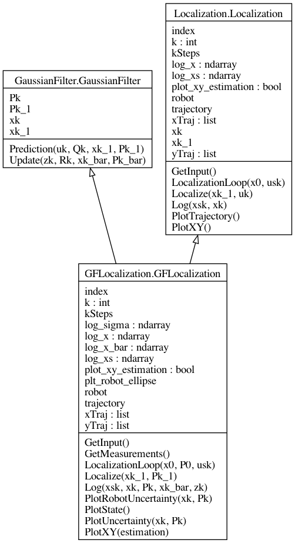
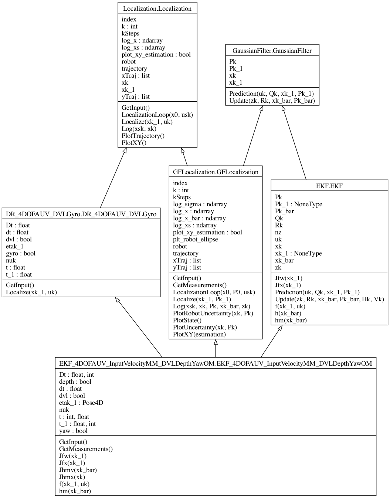
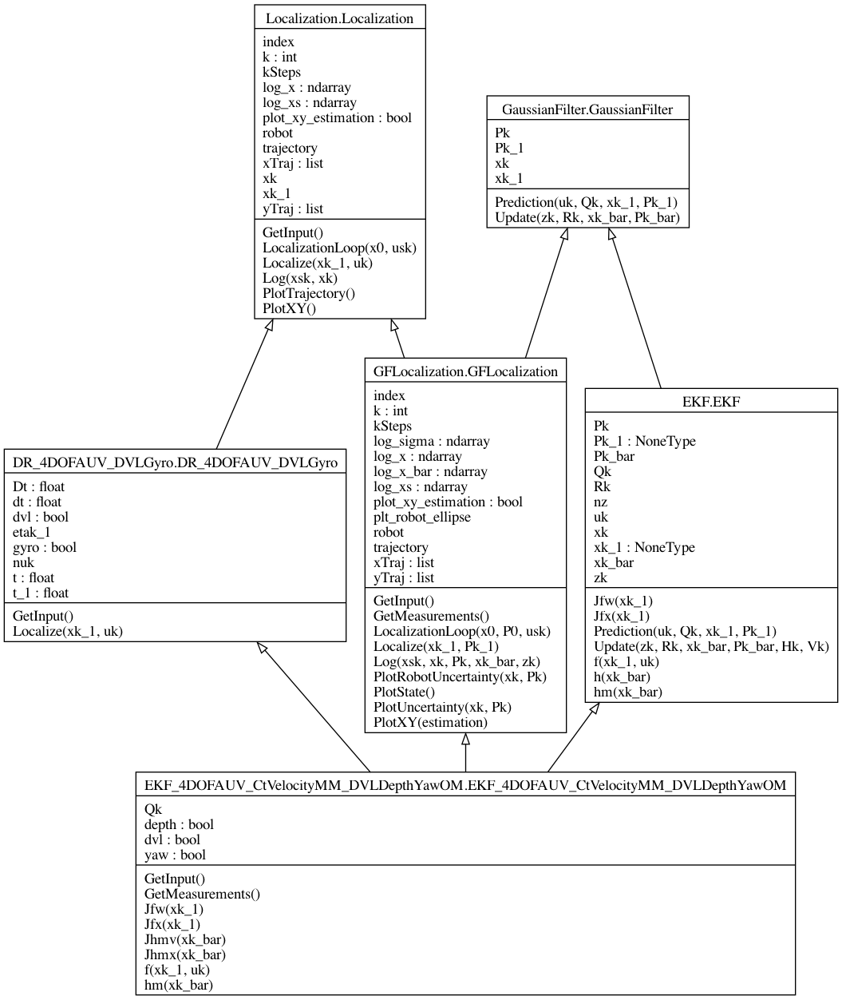
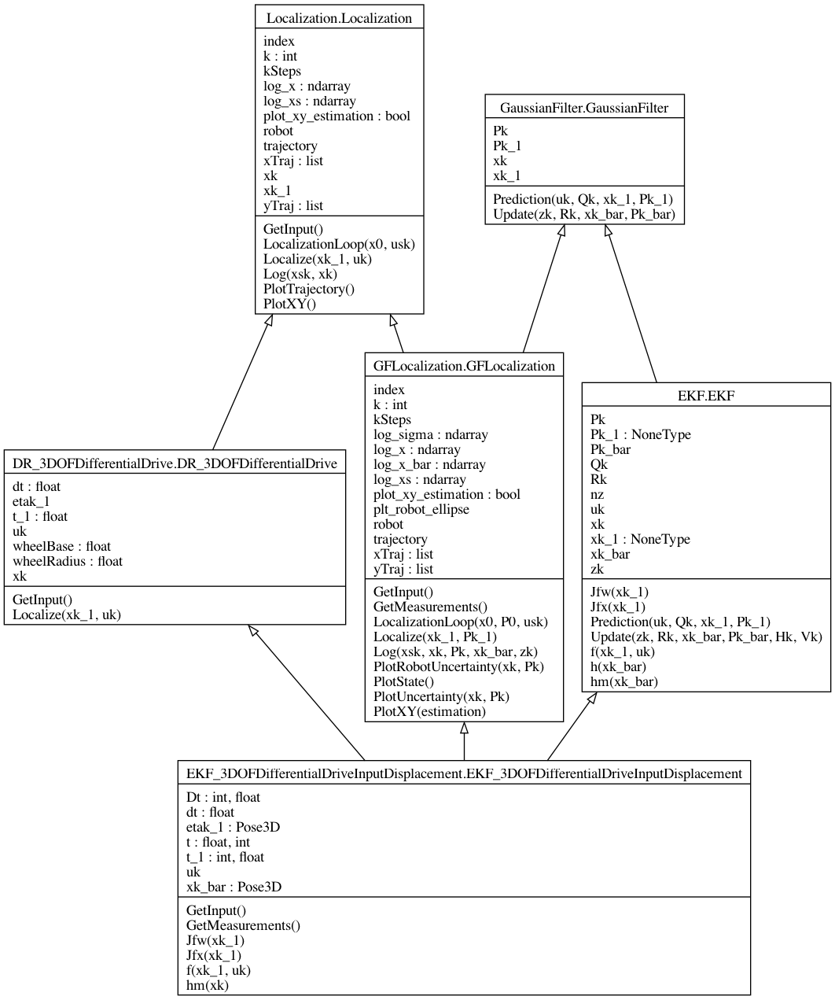
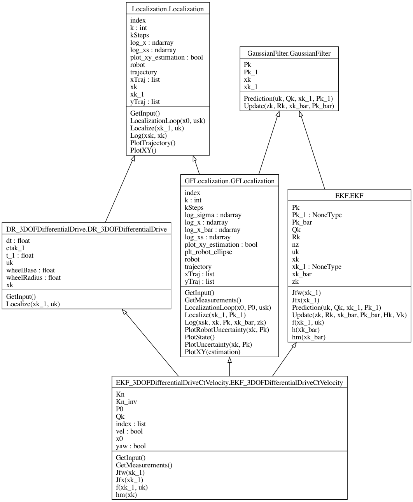

Gaussian Filter Localization
----------------------------

.. autoclass:: GFLocalization.GFLocalization

IndexStruct
-----------
.. autoclass:: IndexStruct.IndexStruct

4 DOF AUV
---------

4 DOF AUV EKF Localization using an Input Velocity Motion Model with Depht, Yaw and Linear Velocity Measurements
================================================================================================================

.. autoclass:: EKF_4DOFAUV_InputVelocityMM_DVLDepthYawOM.EKF_4DOFAUV_InputVelocityMM_DVLDepthYawOM

4 DOF AUV EKF Localization using a Constant Velocity Motion Model with Depht, Yaw and Linear Velocity Measurements
==================================================================================================================

.. autoclass:: EKF_4DOFAUV_CtVelocityMM_DVLDepthYawOM.EKF_4DOFAUV_CtVelocityMM_DVLDepthYawOM

3 DOF Differential Drive Mobile Robot
-------------------------------------

Differential Drive EKF Localization Using an Input displacement Motion Model
============================================================================

.. autoclass:: EKF_3DOFDifferentialDriveInputDisplacement.EKF_3DOFDifferentialDriveInputDisplacement

Differential Drive EKF Localization Using a Constant Velocity Motion Model
==========================================================================

.. autoclass:: EKF_3DOFDifferentialDriveCtVelocity.EKF_3DOFDifferentialDriveCtVelocity

